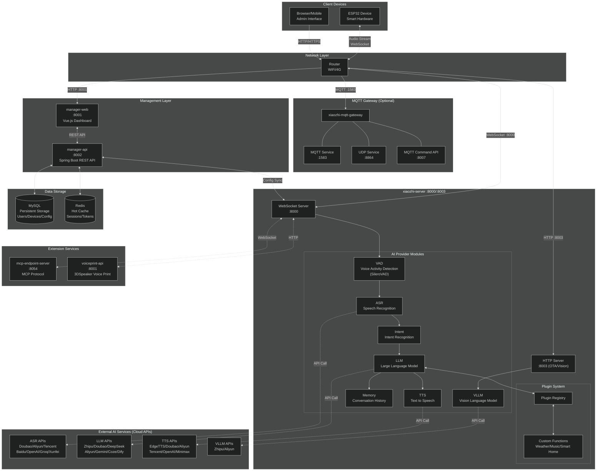
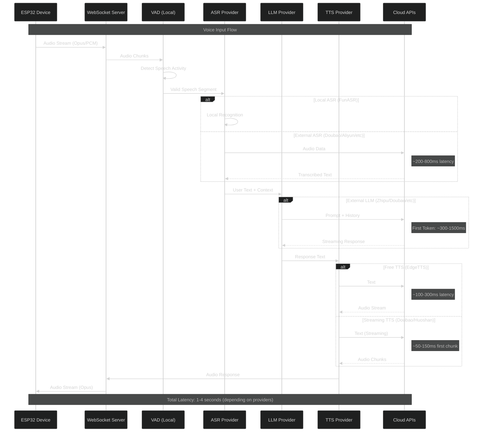
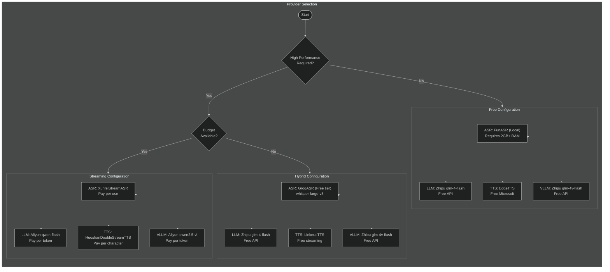

# xiaozhi-esp32-server Architecture

## System Architecture Diagram



## Data Flow: Voice Interaction with External Models



## Provider Selection: Local vs External



## Latency Breakdown by Component

```mermaid
%%{init: {'theme': 'dark'}}%%
gantt
    title Voice Interaction Latency (External APIs)
    dateFormat X
    axisFormat %L ms

    section Non-Streaming
    VAD Processing      :a1, 0, 50
    ASR (Doubao)        :a2, after a1, 750
    LLM First Token     :a3, after a2, 1000
    LLM Full Response   :a4, after a3, 700
    TTS Generation      :a5, after a4, 700
    Audio Playback Start:a6, after a5, 100

    section Streaming
    VAD Processing      :b1, 0, 50
    ASR Stream (Xunfei) :b2, after b1, 350
    LLM First Token     :b3, after b2, 300
    TTS First Chunk     :b4, after b3, 150
    Audio Playback Start:b5, after b4, 50
```



## Simplified Architecture (External APIs Only)

```mermaid
%%{init: {'theme': 'dark'}}%%
flowchart LR
    subgraph Device["ESP32 Device"]
        MIC["Microphone"]
        SPK["Speaker"]
    end

    subgraph Server["xiaozhi-server (Lightweight)"]
        WS["WebSocket<br/>:8000"]
        VAD["VAD<br/>(Local SileroVAD)<br/>~100MB RAM"]
    end

    subgraph CloudASR["Cloud ASR"]
        GASR["GroqASR<br/>or DoubaoASR"]
    end

    subgraph CloudLLM["Cloud LLM"]
        GLLM["Zhipu glm-4-flash<br/>or DoubaoLLM"]
    end

    subgraph CloudTTS["Cloud TTS"]
        GTTS["EdgeTTS<br/>or DoubaoTTS"]
    end

    MIC -->|"Audio"| WS
    WS --> VAD
    VAD -->|"Speech Segment"| GASR
    GASR -->|"Text"| GLLM
    GLLM -->|"Response"| GTTS
    GTTS -->|"Audio"| WS
    WS -->|"Audio"| SPK

    style Server fill:#2d3748,stroke:#4a5568
    style CloudASR fill:#553c9a,stroke:#6b46c1
    style CloudLLM fill:#2c5282,stroke:#3182ce
    style CloudTTS fill:#285e61,stroke:#319795
```



## Resource Requirements

| Deployment Mode | RAM | CPU | GPU | Network | Notes |
|----------------|-----|-----|-----|---------|-------|
| **Full Local** (FunASR + Local LLM) | 8GB+ | 4 cores | Optional | Not required | Slower but private |
| **Hybrid** (Local VAD + External APIs) | 2GB | 2 cores | None | Required | Recommended for low-end servers |
| **Full External** (All Cloud APIs) | 512MB | 1 core | None | Required | Fastest, lowest resource |

## External API Endpoints

| Provider | Service | Endpoint | Free Tier |
|----------|---------|----------|-----------|
| **Zhipu** | LLM | `https://open.bigmodel.cn/api/paas/v4/` | Yes (glm-4-flash) |
| **Zhipu** | VLLM | `https://open.bigmodel.cn/api/paas/v4/` | Yes (glm-4v-flash) |
| **Microsoft** | TTS | Edge TTS (local library) | Yes (Unlimited) |
| **Groq** | ASR | `https://api.groq.com/openai/v1/audio/transcriptions` | Yes (Limited) |
| **Aliyun** | LLM | `https://dashscope.aliyuncs.com/compatible-mode/v1` | Limited |
| **Doubao** | LLM | `https://ark.cn-beijing.volces.com/api/v3` | 500K tokens |
| **Doubao** | TTS | `https://openspeech.bytedance.com/api/v1/tts` | Paid only |
| **Doubao** | ASR | Volcengine API | Paid only |

## Latency Comparison Table

| Configuration | ASR | LLM (TTFT) | TTS | Total to First Audio |
|--------------|-----|------------|-----|---------------------|
| **Free (Non-streaming)** | ~800ms | ~1000ms | ~500ms | ~2.5-3.5s |
| **Free (Streaming)** | ~400ms | ~500ms | ~200ms | ~1.2-1.5s |
| **Paid (Streaming)** | ~200ms | ~300ms | ~100ms | ~0.7-1.0s |
| **Local FunASR + Free** | ~300ms | ~500ms | ~200ms | ~1.2-1.5s |

> TTFT = Time To First Token

## Configuration Example (Lightweight External APIs)

```yaml
# Minimal resource deployment - all external APIs
# Server requirements: 512MB RAM, 1 CPU core

selected_module:
  VAD: SileroVAD          # Local, lightweight (~100MB)
  ASR: GroqASR            # External, free tier available
  LLM: ChatGLMLLM         # External, free (Zhipu glm-4-flash)
  TTS: EdgeTTS            # External, free (Microsoft)
  VLLM: ChatGLMVLLM       # External, free (Zhipu glm-4v-flash)
  Memory: nomem           # No memory for simplicity
  Intent: function_call   # Uses LLM for intent recognition

ASR:
  GroqASR:
    type: openai
    api_key: your_groq_api_key
    base_url: https://api.groq.com/openai/v1/audio/transcriptions
    model_name: whisper-large-v3-turbo
    output_dir: tmp/

LLM:
  ChatGLMLLM:
    type: openai
    model_name: glm-4-flash
    url: https://open.bigmodel.cn/api/paas/v4/
    api_key: your_zhipu_api_key

TTS:
  EdgeTTS:
    type: edge
    voice: zh-CN-XiaoxiaoNeural  # or en-US-JennyNeural for English
    output_dir: tmp/

VLLM:
  ChatGLMVLLM:
    type: openai
    model_name: glm-4v-flash
    url: https://open.bigmodel.cn/api/paas/v4/
    api_key: your_zhipu_api_key
```

## References

- [Performance Testing Guide](./performance_tester.md)
- [Performance Benchmarks](https://github.com/xinnan-tech/xiaozhi-performance-research)
- [FAQ - Improving Response Speed](./FAQ.md#5)
- [Deployment Guide](./Deployment.md)
- [Communication Protocol](https://ccnphfhqs21z.feishu.cn/wiki/M0XiwldO9iJwHikpXD5cEx71nKh)
